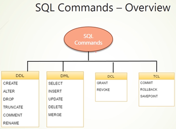

# [The Complete Oracle SQL Bootcamp](https://www.udemy.com/course/the-complete-oracle-sql-development-bootcamp-2021)



## Instalación de Usuario HR

Para habilitar el `schema hr` debemos descargarlo de [github de oracle](https://github.com/oracle-samples/db-sample-schemas/releases/tag/v21.1) y luego proceder a instalar de la siguiente manera.

1. Descromprimimos el empaquetado y nos ubicamos mediante la terminal en el directorio `/human_resources`
2. Nos conectamos usando `sqlplus` y seguimos los siguientes pasos como se muestra en la imagen:

    

3. Cuando demos enter en según la última instrucción de la imagen anterior, veremos el siguiente error:

    ````bash
    SP2-0310: unable to open file "__SUB__CWD__/human_resources/hr_cre.sql"
    SP2-0310: unable to open file "__SUB__CWD__/human_resources/hr_popul.sql"
    SP2-0310: unable to open file "__SUB__CWD__/human_resources/hr_idx.sql"
    SP2-0310: unable to open file "__SUB__CWD__/human_resources/hr_code.sql"
    SP2-0310: unable to open file "__SUB__CWD__/human_resources/hr_comnt.sql"
    SP2-0310: unable to open file "__SUB__CWD__/human_resources/hr_analz.sql"
    ````

4. Es importante el orden en el que nos mostró los archivos anteriores pues los iremos ejecutando uno por uno en ese mismo orden agregándole el `@` delante del nombre del archivo:

    ````bash
    SQL> @hr_cre.sql
    SQL> @hr_popul.sql
    SQL> @hr_idx.sql
    SQL> @hr_code.sql
    SQL> @hr_comnt.sql
    SQL> @hr_analz.sql
    ````

5. Al finalizar la ejecución del último archivo podremos ver si el usuario `HR` fue instalado correctamente tal como se muestra en la imagen:

    

6. Podemos abrir nuestro esquema, en este caso usaré `DBeaver`:

    
    

## Esquema Hr


